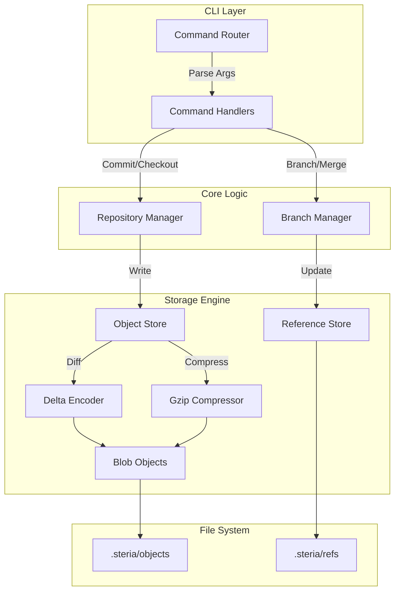

# Steria VCS

<p align="center">
  
  
  
</p>

<p align="center">
  
  
  
</p>

**Steria** is a modern, distributed version control system (DVCS) written in Go. It prioritizes storage efficiency through aggressive compression and delta encoding, while offering a developer-friendly CLI with built-in metrics and project management tools.

---

## 🏗️ Architecture

Steria stores history as a Directed Acyclic Graph (DAG) of commit objects, using a content-addressable storage model similar to Git but optimized for large binary handling.



## Key Features

### Optimized Storage

- **Delta Encoding**: Automatically computes and stores only the differences for files changes >1MB, significantly reducing repository size for binary-heavy projects.
- **Compression**: All blobs are transparently Gzip-compressed.
- **Content-Addressable**: Deduplication of identical file content across the entire history.

### Security & Integrity

- **Signed Commits**: Every commit is cryptographically signed by the author.
- **Tree Hashing**: Merkle tree structure ensures repository integrity; any corruption is immediately detectable.

### Developer Experience

- **Performance Metrics**: Every command outputs execution time and resource profiling.
- **Project Management**: Built-in support for managing multi-repository workspaces (`steria projects ...`).
- **Interactive Ignore**: Easy management of `.steriaignore` patterns.

## Documentation

- [**Architecture Overview**](Docs/architecture.md): Deep dive into the system design.
- [**Delta Encoding**](Docs/RepositoryCompressionAndDeltaEncoding.md): How Steria handles large binary files efficiently.
- [**CLI Reference**](SteriaCommands.txt): Complete command list and usage examples.
- [**Roadmap**](Docs/roadmap.md): Future plans and upcoming features.

## Getting Started

### Prerequisites

- **Go 1.21+** Toolchain

### Installation

```bash
# Clone the repository
git clone https://github.com/KleaSCM/Steria.git
cd Steria

# Build the binary
go build -o bin/steria ./main.go

# (Optional) Add to PATH
export PATH=$PATH:$(pwd)/bin
```

### Basic Usage

```bash
# Clone an existing repository
steria clone <url>

# Check repository status
steria status

# Commit changes (automatically stages modified files)
steria commit "Update documentation" "KleaSCM"

# Complete a task (shortcut for commit + sync)
steria done
```

## Project Structure

```
Steria/
├── cmd/                # CLI Command implementations
├── core/               # High-level business logic
├── internal/
│   ├── storage/        # Object writing, blobs, delta encoding
│   ├── security/       # Hashing and signatures
│   ├── metrics/        # Performance profiling tool
│   └── web/            # Embedded web interface
├── Docs/               # Architectural documentation
└── Tests/              # Integration and unit tests
```

## License

MIT License. See [LICENSE](LICENSE) for details.

## Contact

Maintainer: <KleaSCM@gmail.com>
